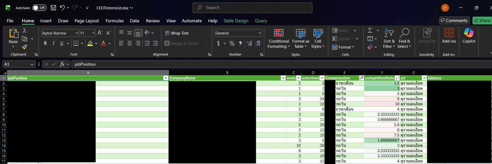

CEDTInternScraper : Your Internship Company Decision Helper (For only CEDT students)

To run this project and generate your results, please follow these steps:

1. Cloning this repository to local.
2. Install Playwright by running **npx playwright install**.
3. Install the dependencies by running **npm install**.
4. Fill in your Username (Student ID) and Password in the designated fields. (Ex. USERNAMEID="673xxxxxxx" PASSWORD="abcxxxx").
5. Rename .envdraft to .env.
6. Run Playwright: Execute the tests using the command **npx playwright test.**
For security reasons, the results of the script will only be visible when you run the project on your local machine.

After scraping, you will get .csv file. You should import this into Excel to continue the analysis.
1. Open Excel.
2. Click Data > From Text/CSV
3. import csv file that you got from scraping.
4. Analyze each job position as desired,such as sorting competitionRatio, coloring columns, sorting by compensation and more.

Below is an example of an Excel file used for analysis.

